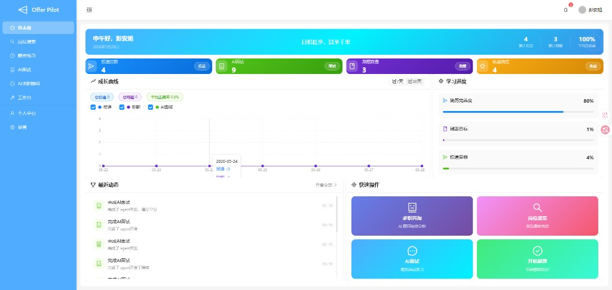
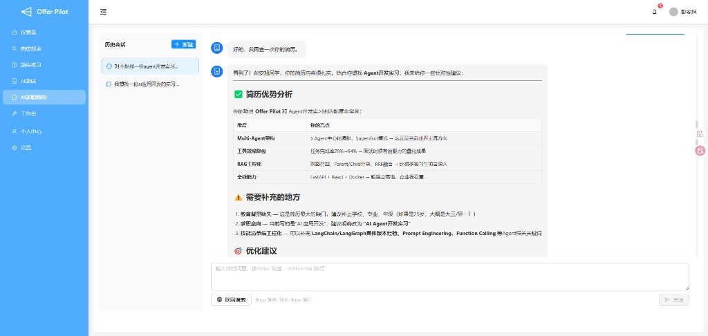
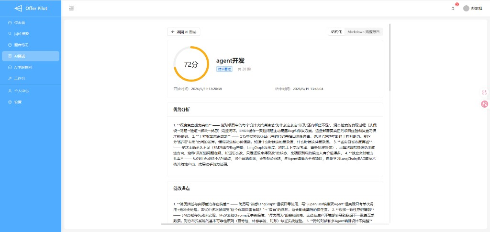
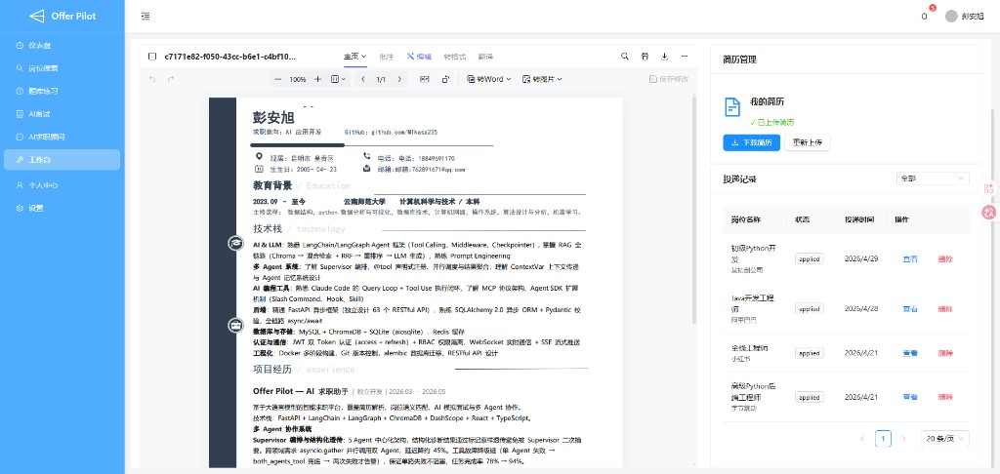
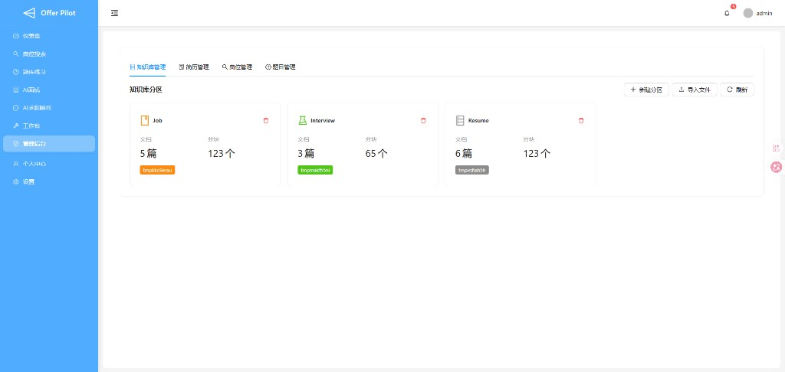

<p align="center">
  <h1 align="center">Offer Pilot</h1>
  <p align="center"><strong>AI 驱动的全栈求职助手</strong> — 多智能体协作 · 长期记忆 · RAG 检索增强 · AI 模拟面试</p>
</p>

<p align="center">
  
  
  
  
  
  
</p>

---

<p align="center">
  
</p>

## 效果展示

| 仪表盘 | AI 求职顾问 | AI 面试报告 |
|:---:|:---:|:---:|
|  |  |  |
| 投递 / 刷题 / 面试成长曲线与快捷入口 | Supervisor 编排 + 结构化简历分析 | 逐题评估、优劣势与 Markdown 完整报告 |

| 工作台 | 管理后台 · 知识库 |
|:---:|:---:|
|  |  |
| 简历预览、投递记录与 RAG 问答 | 岗位 / 面试 / 简历分区文档与分块管理 |

## 系统架构

```
┌──────────────────────────────────────────────────────────────┐
│                      前端 (React + Vite)                       │
│  仪表盘 │ 岗位搜索 │ AI顾问 │ AI面试 │ 工作台 │ 管理后台        │
└──────────────────────────┬───────────────────────────────────┘
                           │ HTTP + SSE (流式对话)
                           ▼
┌──────────────────────────────────────────────────────────────┐
│                   后端 (FastAPI :8080)                         │
│                                                              │
│  ┌─────────────┐  ┌──────────┐  ┌──────────────────────┐    │
│  │ Supervisor   │  │ REST API │  │ RAG Pipeline          │    │
│  │ (Agent 编排)  │  │ (CRUD)   │  │ 解析→分块→向量→检索    │    │
│  └──────┬───────┘  └────┬─────┘  └──────────┬───────────┘    │
│         │               │                   │                │
└─────────┼───────────────┼───────────────────┼────────────────┘
          │               │                   │
          ▼               ▼                   ▼
   ┌──────────┐   ┌──────────────┐   ┌──────────────┐
   │ LLM API  │   │  MySQL 8.0   │   │  ChromaDB     │
   │ DashScope│   │  (业务数据)   │   │  (向量存储)   │
   │ DeepSeek │   └──────────────┘   └──────────────┘
   │ Tavily   │          │
   └──────────┘          ▼
                  ┌──────────────┐
                  │  Redis 7     │  (可选：限流 / 会话缓存 / 记忆缓存)
                  │  不可用则降级  │
                  └──────────────┘
```

- **前端** React + TypeScript + Vite，Ant Design；开发端口 5173，启动时轮询 `/health` 等待后端就绪
- **后端** FastAPI 异步服务，端口 8080，SSE 流式推送 Agent 回复与编排进度
- **Agent** LangGraph + `create_agent()`，Supervisor 编排；**共享** `AsyncSqliteSaver` 会话 Checkpoint
- **数据库** MySQL 存业务数据；SQLite 存 Agent Checkpoint 与长期记忆事件
- **Redis**（可选）连接失败时自动降级为进程内限流与无缓存模式，不影响核心功能
- **向量库** ChromaDB 存文档分块向量，BM25 + 向量混合检索

## 为什么选择 Offer Pilot？

传统求职平台只能**搜岗位和投简历**，Offer Pilot 在此基础上构建了一套完整的 AI 辅助体系：

| 痛点 | Offer Pilot 方案 |
|------|-----------------|
| 简历不知道怎么写 | **简历诊断** — 多维度评分 + 逐项改进建议 |
| 海投没针对性 | **岗位匹配** — 简历 vs JD 逐维度对比，量化差距 |
| 面试没底 | **AI 模拟面试** — 基于真实简历出题，逐题评估报告 |
| 每次对话像失忆 | **长期记忆** — 自动识别并持久化偏好/背景/洞察 |
| 搜岗位靠手动翻 | **智能搜索** — 自然语言搜岗位 + 个性化推荐 |

## 关键设计

面向「搜岗 → 改简历 → 练面试 → 长期陪跑」的完整链路，而不是单点聊天工具。

| 设计点 | 做法 | 带来的体验 |
|--------|------|------------|
| **统一对话入口** | `/api/v1/agent/chat/stream` + Supervisor 编排子 Agent | 用户只在一个顾问窗口提问，背后自动路由简历 / 求职 / 记忆能力 |
| **上下文预算** | `ContextBundle` 分层注入：系统 / 记忆 / 历史 / 用户，字符上限可配置 | 控制 Token 成本，同时保证记忆与近期对话不丢失 |
| **会话持久化** | LangGraph `AsyncSqliteSaver` 共享 Checkpoint + 可选 Redis 历史缓存 | 多轮对话可续聊；读历史不必每次扫完整 Checkpoint |
| **长期记忆闭环** | Memory Agent 写入 + SQLite 事件队列 + 后台 Worker 重试 | 偏好 / 事实 / 洞察自动沉淀，下次对话按意图注入 |
| **简历结构化直通** | 诊断类问题绕过 Supervisor，子 Agent 结构化输出 + 格式化 | 表格化优势分析，避免长文堆砌（见 AI 顾问截图） |
| **面试全链路** | 流式问答 → 结束触发后台评估 → 结构化 + Markdown 双视图报告 | 面试过程与报告解耦，评估中可轮询、完成后可回看 |
| **RAG 可运营** | 管理后台按分区（岗位 / 面试 / 简历）导入文档与分块 | 知识库与业务数据分离，便于扩充面试题与行业资料 |
| **韧性优先** | Redis / LLM 不可用时降级；`ModelRetryMiddleware`；工具调用上限 | 单实例开发不绑 Redis；生产可逐步增强限流与缓存 |

## 技术选型优势

| 层级 | 选型 | 优势说明 |
|------|------|----------|
| **API** | FastAPI + Uvicorn | 原生异步，SSE 流式推送 Agent 状态与 Token；OpenAPI 自动生成 |
| **ORM** | SQLAlchemy 2.0 + aiomysql | 与 FastAPI 异步模型一致，岗位 / 投递 / 面试等业务表统一事务 |
| **Agent** | LangChain `create_agent` + LangGraph Checkpoint | 工具调用、重试、摘要中间件可组合；会话状态可落库续聊 |
| **编排** | Supervisor + 子 Agent 工厂注册 | 新增专家只需注册工厂与工具，HTTP 层经 `facade` 保持稳定 |
| **向量检索** | ChromaDB + BM25 混合 + Rerank | 简历/JD 既匹配关键词又覆盖语义；支持 DashScope Embedding / Rerank |
| **缓存** | Redis（可选） | 限流、会话历史、记忆上下文热数据；连接失败自动回退内存实现 |
| **前端** | React 18 + Vite + Ant Design + TanStack Query | 模块按 `features` 划分；Query 缓存岗位/报告；`BackendStartupGuard` 等待后端就绪 |
| **部署** | Docker 多阶段构建 + Compose | 一条命令拉起 MySQL / Redis / 后端；前端 dev profile 热更新 |

## 核心亮点

###  多智能体协作架构

```
                         ┌─────────────────────┐
                         │    Supervisor        │
                         │  (编排 + 降级容错)    │
                         └──────┬───┬──────┬───┘
                ┌───────────────┤   │      ├───────────────┐
                ▼               ▼   ▼      ▼               ▼
     ┌─────────────┐  ┌─────────────┐  ┌─────────────┐  ┌─────────────┐
     │ Resume      │  │ Career      │  │ Interview   │  │ Memory      │
     │ Agent       │  │ Agent       │  │ Agent       │  │ Agent       │
     │ 简历专家     │  │ 求职顾问     │  │ 面试官       │  │ 记忆管家     │
     └──────┬──────┘  └──────┬──────┘  └──────┬──────┘  └──────┬──────┘
            │                │                │                │
    ┌───────┴───────┐  ┌────┴────┐  ┌────────┴────────┐  ┌───┴───┐
    │ 简历查询       │  │ 岗位搜索 │  │ 简历驱动出题     │  │ 增删改 │
    │ 诊断评分       │  │ 薪资分析 │  │ 逐题追问点评     │  │ 自主判断│
    │ 岗位优化       │  │ 个性化推荐│  │ 综合评估报告     │  │ 过期清理│
    │ 岗位匹配       │  │ 行业资讯 │  │                 │  │        │
    └───────────────┘  └─────────┘  └─────────────────┘  └────────┘
```

所有 Agent **共享**同一 `AsyncSqliteSaver` Checkpointer；Supervisor 智能路由并支持跨领域并行调用（`both_agents_tool`）。编排过程通过 SSE 推送 `progress` 事件，前端 `StreamProcess` 组件展示子任务进度。

<p align="center">
  
</p>

###  长期记忆系统

```
┌─────────────────────────────────────────────────────────┐
│                     记忆生命周期                          │
│                                                         │
│  写入               存储              注入               │
│  ──────            ──────           ──────              │
│  Memory Agent      SQLite           相关性评分           │
│  自主判断          分类存储          定向注入             │
│  ↓                 ↓                ↓                   │
│  覆盖/追加模式     fact/preference   下次对话             │
│  来源追踪          insight/goal     自动携带             │
│                                                         │
│  衰减: 级别1 (7天) → 级别5 (永不过期)                     │
│                                                         │
└─────────────────────────────────────────────────────────┘
```

- **自主管理**: Memory Agent 分析对话后自主决定新增/更新/删除
- **3D 相关性评分**: 内容匹配度 × 时间衰减 × 访问频次加成
- **上下文注入**: 按意图分类 + 类别配额自动注入，单次注入 ≤ 500 字符
- **append 模式**: 同 key 写入时不覆盖，自动追加时间戳后缀（解决"多段工作经历"问题）

###  RAG 混合检索管道

```
文档摄入 → 分块 → 向量化 (ChromaDB) ─┐
                                     ├── 混合检索 → 重排序 → 生成
关键词索引 → BM25 稀疏检索 ──────────┘
```

- 简历解析 / 岗位分析 / 知识库问答均经 RAG 增强
- BM25 + 向量检索的混合策略，兼顾精确匹配与语义泛化
- 支持 PDF 简历自动解析与分块存储

<p align="center">
  
</p>

###  AI 模拟面试

```
选择面试类型 → 输入岗位信息 → AI 基于简历出题
                                    ↓
                          逐题追问 + 实时点评
                                    ↓
                          面试结束 → 生成评估报告
```

- 支持**技术面 / HR 面 / 综合面**三种类型
- 基于真实简历内容**个性化出题**，深入项目细节
- 每道题**实时点评**，指出亮点和不足
- 结束后生成完整**评估报告**: 逐题评分 + 综合评估 + 改进建议

<p align="center">
  
</p>

###  工作台一站式

- 简历上传与在线预览、投递记录跟踪
- 集成简历诊断 / 岗位匹配 / RAG 问答，减少页面跳转

<p align="center">
  
</p>

## 功能总览

| 模块 | 功能 | 状态 |
|------|------|------|
| 仪表盘 | 求职数据统计、投递追踪 | ✅ |
| 岗位管理 | CRUD、多维度搜索、收藏 | ✅ |
| 工作台 | 简历上传、解析、投递 | ✅ |
| 题库 | 面试题管理与分类 | ✅ |
| **AI 求职顾问** | 智能对话、岗位搜索、薪资分析、个性化推荐 | ✅ |
| **AI 简历优化** | 简历诊断、岗位匹配、针对 JD 优化、段落润色 | ✅ |
| **AI 模拟面试** | 技术面/HR面/综合面、逐题评估、综合报告 | ✅ |
| **长期记忆** | 自动捕获偏好/背景/洞察、智能衰减、上下文注入 | ✅ |
| **RAG 知识库** | 文档摄入、混合检索、增强生成 | ✅ |
| 管理后台 | 知识库管理、简历管理、分区管理 | ✅ |
| 个人中心 | 用户信息、简历版本管理 | ✅ |

## 快速开始

### 环境要求

| 软件 | 版本 | 用途 |
|------|------|------|
| Python | 3.10+ | 后端运行环境 |
| MySQL | 8.0+ | 业务数据存储 |
| Redis | 7+ | 可选：限流与会话/记忆缓存（推荐 Docker 一并启动） |
| Node.js | 18+ | 前端构建 |
| Docker | 20+ | 可选：Compose 一键编排全栈 |
| [uv](https://docs.astral.sh/uv/) | 最新 | Python 包管理 (推荐) |

### 获取 API Key

部署前需要申请以下第三方服务：

| 服务 | 用途 | 申请地址 | 免费额度 |
|------|------|---------|---------|
| **阿里百炼 DashScope** | LLM 大模型 | [dashscope.console.aliyun.com](https://dashscope.console.aliyun.com) | 100万 token/月 |
| **Tavily Search** | 互联网搜索 | [tavily.com](https://tavily.com) | 1000 次/月 |
| **DeepSeek** (备选) | 备选 LLM | [platform.deepseek.com](https://platform.deepseek.com) | 500万 token |

> **推荐配置**: 主 LLM 用 DashScope (国内访问快)，备选 DeepSeek。免费额度足够个人使用。

### 后端部署

```bash
# 1. 克隆
git clone https://github.com/M1kasa235/ai-resume.git
cd ai-resume

# 2. 安装依赖
uv sync
# 或: pip install -r requirements.txt

# 3. 配置环境变量
cp .env.example .env
```

编辑 `.env`，至少填写以下 3 项：

```env
MYSQL_PASSWORD=你的数据库密码
SECRET_KEY=随机字符串
DASHSCOPE_API_KEY=sk-xxxxxxxxxxxxx
TAVILY_API_KEY=tvly-xxxxxxxxxxxxx
REDIS_URL=redis://localhost:6379/0
```

```bash
# 4. 创建 MySQL 数据库
mysql -u root -p -e "CREATE DATABASE ai_job CHARACTER SET utf8mb4 COLLATE utf8mb4_unicode_ci;"

# 5. 执行数据库迁移 (创建表结构)
alembic upgrade head

# 6. 启动后端 (端口 8080)
python run.py
```

### 验证后端

```bash
# 健康检查
curl http://localhost:8080/health
# → {"status":"ok","version":"1.0.0","checkpointer":"AsyncSqliteSaver","redis":"connected"}

# 查看 API 文档
open http://localhost:8080/docs
```

### 前端部署

```bash
cd frontend

# 安装依赖
npm install

# 确认 API 地址 (默认指向 localhost:8080)
cat .env.development
# VITE_API_BASE_URL=http://localhost:8080

# 启动开发服务器 (端口 5173)
npm run dev
```

访问 http://localhost:5173 → 注册账号 → 上传简历 → 开始使用 AI 求职顾问。

### Docker Compose 一键部署（推荐）

项目根目录提供 `docker-compose.yml`，可编排 **MySQL + Redis + 后端**；前端开发服务可选。

```bash
# 1. 配置环境变量
cp .env.example .env
# 编辑 .env：MYSQL_PASSWORD、SECRET_KEY、DASHSCOPE_API_KEY、TAVILY_API_KEY

# 2. 仅启动依赖（本地跑 python run.py 时）
docker compose up -d mysql redis

# 3. 启动后端容器（连 compose 内 mysql/redis）
docker compose up -d backend

# 4. 可选：连同前端开发容器
docker compose --profile dev up -d

# 查看日志
docker compose logs -f backend
```

Compose 默认映射：

| 服务 | 宿主机端口 | 说明 |
|------|-----------|------|
| MySQL | 3307 → 3306 | 避免与本地 MySQL 冲突 |
| Redis | 6379 | 限流 / 缓存；连不上时后端自动降级 |
| Backend | 8080 | FastAPI |
| Frontend (dev profile) | 5173 | Vite 热更新 |

容器内后端请将 `.env` 中 `MYSQL_HOST=mysql`、`REDIS_URL=redis://redis:6379/0`（Compose 已注入部分变量）。

### 单容器后端镜像

```bash
docker build -t offer-pilot .
docker run -d --name offer-pilot -p 8080:8080 --env-file .env offer-pilot
```

> 单容器镜像不含 MySQL/Redis，需自行提供并在 `.env` 中配置连接地址。

### Redis（单实例、可选）

| 能力 | 配置 | 行为 |
|------|------|------|
| 分布式限流 | `REDIS_RATE_LIMIT_ENABLED=true` | Redis 不可用时回退内存限流 |
| 对话历史缓存 | `REDIS_SESSION_CACHE_TTL` | 减轻 Checkpoint 读取 |
| 记忆上下文缓存 | `REDIS_MEMORY_CACHE_TTL` | 跨请求复用组装好的记忆文本 |

不启动 Redis 也可正常运行；生产环境建议 `docker compose up -d redis` 以获得稳定限流与缓存。

## 项目结构

```
├── app/
│   ├── agents/                # 多智能体系统
│   │   ├── facade/            #   API 层统一入口 (chat / interview)
│   │   ├── factories/           #   Agent 工厂 + 角色注册
│   │   ├── orchestration/       #   Supervisor 编排与 SSE 流式
│   │   ├── context/             #   上下文组装 / 意图 / 预算
│   │   ├── memory/              #   长期记忆 (事件队列 + 检索)
│   │   ├── session/             #   会话历史 / checkpoint / 生命周期
│   │   ├── common/              #   协议常量 / 进度文案 / 流式工具
│   │   ├── prompts/             #   各 Agent 系统提示词
│   │   ├── tools/               #   LangChain 工具集
│   │   ├── registry.py          #   Agent 缓存与角色分发
│   │   ├── config.py            #   checkpointer / middleware
│   │   └── trace.py             #   结构化调用追踪
│   ├── api/v1/                # REST API
│   │   ├── agent_chat.py      #   统一对话入口 (SSE 流式)
│   │   ├── interview.py       #   AI 面试 API
│   │   ├── memory.py          #   记忆管理 API
│   │   ├── rag.py             #   RAG 知识库 API
│   │   ├── resume_optimize.py #   简历优化 API
│   │   └── ...
│   ├── rag/                   # RAG 管道
│   │   ├── core/              #   向量存储/分块/解析
│   │   ├── ingestion/         #   文档摄入
│   │   ├── retrieval/         #   混合检索 + 重排序
│   │   ├── pipeline/          #   简历优化 + 岗位匹配
│   │   └── services/          #   RAG 服务层
│   ├── core/                  # 核心配置/安全/LLM
│   ├── models/                # SQLAlchemy 数据模型
│   ├── schemas/               # Pydantic Schema
│   └── services/              # 业务逻辑层 (含 job_lookup 岗位查询)
├── frontend/                  # React 前端
│   └── src/features/
│       ├── aiAdvisor/         #   AI 求职顾问页
│       ├── aiInterview/       #   AI 面试 + 报告 + 记录
│       ├── admin/             #   管理后台
│       ├── dashboard/         #   仪表盘
│       ├── jobs/              #   岗位列表/详情
│       └── ...
├── alembic/                   # 数据库迁移
├── docker-compose.yml         # MySQL + Redis + backend (+ 可选 frontend)
├── db/mysql-init/             # MySQL 初始化脚本
├── Dockerfile                 # 多阶段构建
├── pyproject.toml             # 项目元数据 + 依赖
└── requirements.txt           # Pip 依赖（含 redis>=5.0）
```

### 运行测试

```bash
# 后端单元测试（默认关闭 Redis 限流，使用内存实现）
pytest app/tests -q
```

## Agent 工具矩阵

| Agent | 工具 | 说明 |
|-------|------|------|
| **Supervisor** | `resume_agent_tool` | 调用简历专家 |
| | `career_agent_tool` | 调用求职顾问 |
| | `both_agents_tool` | 并行调用双专家 |
| | `memory_agent_tool` | 调用记忆管家 |
| **Resume** | `query_resume` | 简历事实查询 |
| | `diagnose_resume` | 多维度诊断评分 |
| | `optimize_for_job` | 针对 JD 逐段优化 |
| | `match_resume_to_job` | 岗位匹配度分析 |
| | `polish_section` | 段落润色改写 |
| **Career** | `search_jobs` | 岗位搜索 |
| | `analyze_salary` | 薪资分析 |
| | `get_job_recommendations` | 个性化推荐 |
| | `search_knowledge` | 知识库检索 |
| | `tavily_search` | 互联网资讯搜索 |
| **Interview** | `query_resume` | 读取简历出题 |
| | `search_knowledge` | 获取面试题库 |
| **Memory** | `list_memories` | 查看全部记忆 |
| | `upsert_memory` | 新增/更新记忆 |
| | `delete_memory` | 删除过时记忆 |

## 记忆类别与衰减

| 类别 | 说明 | 示例 | 衰减周期 |
|------|------|------|---------|
| `fact` | 硬事实 | "React 3年经验"、"清华本科" | 180 天 |
| `preference` | 偏好 | "期望薪资 30K"、"只考虑北京" | 90 天 |
| `insight` | 行为洞察 | "系统设计偏弱"、"擅长算法" | 90 天 |
| `goal` | 目标 | "准备跳槽大厂"、"考 AWS 认证" | 30 天 |

## 环境变量参考

| 变量 | 必填 | 说明 |
|------|------|------|
| `APP_NAME` | 否 | 应用名称 (默认: Offer Pilot) |
| `DEBUG` | 否 | 调试模式 (默认: false) |
| `SERVER_HOST` | 否 | 监听地址 (默认: 127.0.0.1) |
| `SERVER_PORT` | 否 | 监听端口 (默认: 8080) |
| `MYSQL_HOST` | 否 | MySQL 地址 |
| `MYSQL_PORT` | 否 | MySQL 端口 |
| `MYSQL_USER` | 否 | MySQL 用户名 |
| `MYSQL_PASSWORD` | **是** | MySQL 密码 |
| `MYSQL_DB` | 否 | 数据库名 |
| `REDIS_URL` | 否 | Redis 连接串 (默认 `redis://localhost:6379/0`) |
| `REDIS_RATE_LIMIT_ENABLED` | 否 | 是否用 Redis 限流 (默认 true) |
| `REDIS_SESSION_CACHE_TTL` | 否 | 对话历史缓存秒数 (默认 300) |
| `REDIS_MEMORY_CACHE_TTL` | 否 | 记忆上下文缓存秒数 (默认 600) |
| `SECRET_KEY` | **是** | JWT 签名密钥 |
| `DASHSCOPE_API_KEY` | **是** | 阿里百炼 API Key |
| `DEEPSEEK_API_KEY` | 否 | DeepSeek API Key (备选) |
| `TAVILY_API_KEY` | **是** | Tavily 搜索 API Key |
| `CORS_ORIGINS` | 否 | 允许的前端域名 |

## API 速览

| 端点 | 方法 | 说明 |
|------|------|------|
| `/health` | GET | 健康检查 |
| `/api/v1/auth/login` | POST | 用户登录 |
| `/api/v1/auth/register` | POST | 用户注册 |
| `/api/v1/jobs/` | GET | 岗位列表 (支持多维度搜索) |
| `/api/v1/jobs/{id}` | GET | 岗位详情 |
| `/api/v1/agent/chat/stream` | POST | **AI 对话入口** (SSE 流式) |
| `/api/v1/agent/chat/history` | GET | 获取对话历史 |
| `/api/v1/interview/start` | POST | 开始 AI 模拟面试 |
| `/api/v1/interview/evaluate/{id}` | POST | 生成面试评估报告 |
| `/api/v1/resume/diagnose` | POST | 简历诊断评分 |
| `/api/v1/resume/match/{job_id}` | POST | 岗位匹配分析 |
| `/api/v1/resume/optimize/{job_id}` | POST | 针对岗位优化简历 |
| `/api/v1/memory/list` | GET | 查看长期记忆 |
| `/api/v1/rag/search` | GET | 知识库搜索 |
| `/api/v1/admin/*` | * | 管理后台 (知识库/简历管理) |

## 常见问题

### 启动报错 `SECRET_KEY must be set`

`.env` 中的 `SECRET_KEY` 不能为空或使用默认值。生成方法：

```bash
python -c "import secrets; print(secrets.token_urlsafe(32))"
```

### 启动报错 `MYSQL_PASSWORD cannot be empty`

MySQL 密码未配置。确保 `.env` 中 `MYSQL_PASSWORD` 不为空。

### `alembic upgrade head` 报连接失败

检查 MySQL 是否运行，以及 `.env` 中 `MYSQL_HOST`/`MYSQL_PORT`/`MYSQL_USER`/`MYSQL_PASSWORD` 是否正确。

### AI 对话无响应

1. 检查 `DASHSCOPE_API_KEY` 是否配置正确
2. 检查网络能否访问 `dashscope.aliyuncs.com`
3. 查看终端日志: `[trace=xxx]` 开头的行包含完整调用链

### 前端请求 404 / CORS 错误

1. 确认后端已启动: `curl http://localhost:8080/health`
2. 确认 `CORS_ORIGINS` 包含前端地址 `http://localhost:5173`

### 前端一直显示「等待后端启动」

开发模式下 `BackendStartupGuard` 会轮询 `/health`。请确认：

1. 后端已监听 8080，且 Vite 代理指向正确（`vite.config.ts` → `/api` 与 `/health`）
2. `curl http://localhost:5173/health` 经代理返回 200

### Redis 显示 unavailable

不影响核心对话与 CRUD。若需限流/缓存：启动 Redis 并检查 `REDIS_URL`；日志中会提示 `Redis unavailable — falling back to in-memory`。

### 记忆功能不生效

记忆由 Memory Agent 自主判断写入，每 10 轮对话自动触发一次。你也可以手动触发：

```bash
curl -X POST http://localhost:8080/api/v1/memory/extract \
  -H "Authorization: Bearer <your_token>"
```

### 数据库表未自动创建

生产模式下建议使用 Alembic 迁移而非自动建表：

```bash
alembic upgrade head
```

## 截图资源

产品截图位于 [`docs/screenshots/`](./docs/screenshots/)：

| 文件 | 说明 |
|------|------|
| `dashboard.png` | 仪表盘首页 |
| `ai-advisor.png` | AI 求职顾问对话 |
| `interview-report.png` | AI 面试评估报告 |
| `workbench.png` | 工作台 |
| `admin-rag.png` | 知识库管理后台 |

## 许可证

MIT License
